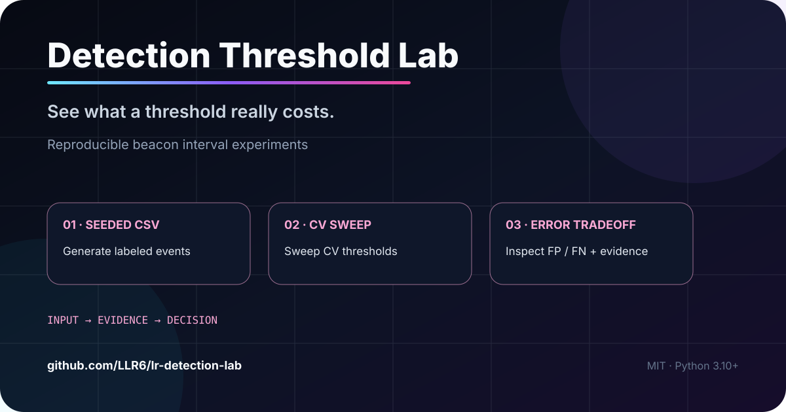
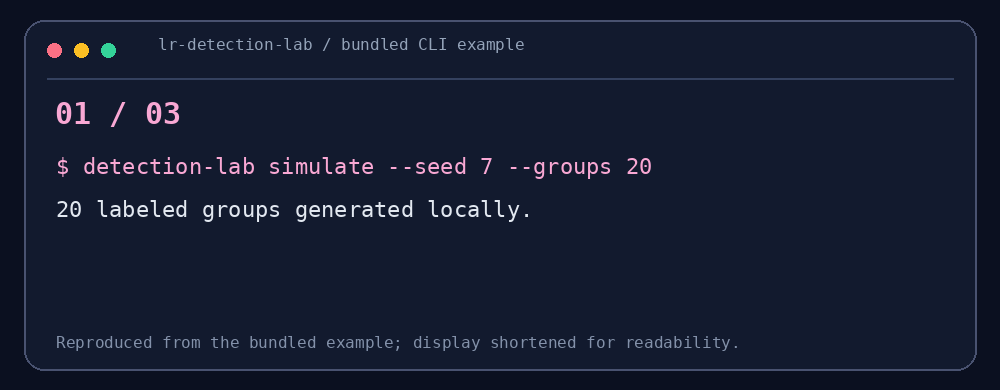

# Detection Threshold Lab

<!-- LR-LAB-CHROME:START -->
<p align="center">
  <a href="https://github.com/LLR6"></a>
  
</p>
<p align="center"><strong>See what a threshold really costs.</strong><br><sub>Reproducible beacon-detection threshold experiments</sub></p>
<p align="center"><a href="https://github.com/LLR6/lr-detection-lab/stargazers"></a>
   </p>
<p align="center"><a href="https://github.com/LLR6">Profile</a> · <a href="https://github.com/LLR6?tab=repositories">All projects</a> · <a href="https://github.com/LLR6/lr-detection-lab/issues">Issues</a></p>
<!-- LR-LAB-CHROME:END -->

<!-- LR-FAMILY-NAV:START -->
<p align="center"><a href="#30-秒试玩">1-minute demo</a> · <a href="#one-minute-result">Result</a> · <a href="./src">Source</a> · <a href="./tests">Tests</a></p>
<!-- LR-FAMILY-NAV:END -->


<p align="center"></p>
<p align="center"></p>
<p align="center"><sub>使用 seed 7、20 组模拟流量的可复现输出；合成数据不是现实环境的效果评估。</sub></p>
<p align="center"><strong>规则很容易写，阈值的代价要拿误报和漏报一起看。</strong></p>
<p align="center">生成带标签的合成时间序列，扫 CV 阈值，输出混淆矩阵和逐组证据。</p>
<p align="center"><a href="#30-秒看懂">30 秒看懂</a> · <a href="#5-分钟开始">5 分钟开始</a> · <a href="#能力与边界">能力与边界</a></p>
<p align="center">    <a href="https://github.com/LLR6/lr-detection-lab/stargazers"></a></p>


> **Reproducible blue-team lab for beacon-detection threshold tuning.**  
> Generate labeled synthetic traffic, sweep coefficient-of-variation thresholds, and inspect the exact TP / FP / TN / FN trade-off behind every decision.

### Why this repo exists

很多检测规则并不是“有没有规则”的问题，而是**阈值放在哪里**的问题。这个仓库把阈值调优拆成一个很小、可复现、能解释的实验：

```text
labeled synthetic traffic
        ↓
group by src/dst
        ↓
interval CV
        ↓
threshold sweep
        ↓
precision / recall / FPR + per-flow evidence
```

适合拿来做三件事：**Blue Team / Detection Engineering 入门实验、阈值敏感性分析、误报案例复盘**。

### One-minute result

在固定 seed 的示例数据上，同一个检测逻辑只改变阈值，就会出现明显不同的误报/漏报组合。仓库不会把某个阈值包装成“最佳答案”，而是把代价完整展示出来，让你自己决定业务上能接受什么。

如果你也在研究 detection engineering、beacon detection 或规则调优，可以 ⭐ 收藏，后续会继续加入时间窗口、类别不平衡与更多可复现实验。


## 30 秒看懂

把“周期性外联”直接当恶意，正常定时任务也会误报。这个实验生成包含抖动 beacon 和正常周期任务的**合成样本**，按 `(source, destination)` 分组，计算正间隔的 `CV = population_std(intervals) / mean(intervals)`，将 `CV <= threshold` 标为周期候选，再与标签对照。

```text
固定种子生成 CSV → 阈值扫描 → TP / FP / TN / FN → 逐组证据
```

## 30 秒试玩

```bash
python -m pip install -e .
detection-lab simulate --seed 7 --groups 20 --output demo.csv
detection-lab evaluate demo.csv --thresholds 0.05,0.1,0.2,0.3,0.5 --output report.json
```

这组**合成样本**的实际输出节选：

| CV 阈值 | TP | FP | FN | Precision | Recall |
| ---: | ---: | ---: | ---: | ---: | ---: |
| 0.05 | 8 | 0 | 2 | 1.00 | 0.80 |
| 0.20 | 9 | 2 | 1 | 0.8182 | 0.90 |
| 0.30 | 10 | 2 | 0 | 0.8333 | 1.00 |

阈值调高后多找到两组 beacon，也多报了两组正常行为。`report.json` 同时保留每个实体对的事件数、平均间隔、CV 与时间范围。

## 三个值得看的点

- **可复现**：固定种子，同一参数可以重新生成同一份标签数据。
- **看到代价**：同时报告 Precision、Recall、误报率与 TP / FP / TN / FN。
- **回查证据**：每组保留间隔统计，而不是只给“可疑/正常”标签。

## 5 分钟开始

要求 Python 3.10+。

```bash
git clone https://github.com/LLR6/lr-detection-lab.git
cd lr-detection-lab
python -m pip install -e .
detection-lab simulate --seed 7 --groups 20 --output demo.csv
detection-lab evaluate demo.csv --thresholds 0.05,0.1,0.2,0.3,0.5 --output report.json
```

输入 CSV 列为 `timestamp,source,destination,label`，标签为 `beacon` 或 `benign`。事件不足或间隔非正的组会被排除，报告会注明排除条件；同组标签冲突会报错。

## 能力与边界

合成样本只用于理解阈值取舍，不能证明现实网络下的最优阈值；低 CV 也不能单独证明 C2。真实使用需要合法采集、人工标注和对业务定时任务的单独核查。本工具不抓包、不扫描、不访问网络。

## 参与 / Help Wanted

欢迎提交**去敏且有标注**的数据生成思路或误报案例。下一步可试时间窗口、其他抖动分布、标签不平衡及与 NightWatch 的规则对照。验证代码：`python -m unittest discover -s tests`。

作者：LLR6 · MIT License

<!-- LR-CONTENT-UPGRADE:START -->
## v0.2：从“扫阈值”到“比较阈值”

报告现在除 TP / FP / TN / FN、Precision、Recall、FPR 外，还输出：

- Specificity
- F1
- Balanced Accuracy
- Youden's J
- Recall–FPR Pareto Frontier

`pareto_frontier` 只保留没有被其他阈值同时在 Recall 与 FPR 上支配的候选点。

这不是“自动选最佳阈值”。真实环境里误报成本和漏报成本不同，业务能够承受的调查量也不同，所以工具只负责把取舍透明化。

完整解释见 [docs/METRICS.md](docs/METRICS.md)。

<!-- LR-CONTENT-UPGRADE:END -->

<!-- LR-RELATED:START -->
### Related LR Lab projects
- [NightWatch](https://github.com/LLR6/Cybersecurity-Detection-Engineering-Android-Automation-Learning-by-Building) — apply explainable detection rules to event streams.
- [Detector Resilience Lab](https://github.com/LLR6/LR-Detector-Resilience-Lab) — study how defensive models degrade under feature drift.
- [LR-SOC-Copilot](https://github.com/LLR6/LR-SOC-Copilot) — correlate alerts into evidence-backed cases.
<!-- LR-RELATED:END -->

<!-- LR-ENGINEERING-REF:START -->
## Engineering Reference

[Architecture](docs/ARCHITECTURE.md) · [Metrics](docs/METRICS.md) · [Security](SECURITY.md) · [Contributing](CONTRIBUTING.md) · [Changelog](CHANGELOG.md) · [Release checklist](docs/RELEASE_CHECKLIST.md) · [Replicate schema](schemas/replicate-report.schema.json)

These files document the project's architecture, safety boundaries, reproducibility assumptions and release process.
<!-- LR-ENGINEERING-REF:END -->

<!-- LR-LAB-FOOTER:START -->
---
<p align="center"><sub>Part of <a href="https://github.com/LLR6">LR Lab</a> · Security × AI × Android × Automation</sub><br><sub>Build things that are useful, inspectable, and reproducible.</sub></p>
<!-- LR-LAB-FOOTER:END -->

<!-- LR-DEEP-CONTENT-3:START -->
## Multi-seed replicate

单个随机种子容易让结果看起来比实际更稳定。现在可以直接重复多组合成实验：

```bash
detection-lab replicate \
  --seeds 1,2,3,4,5 \
  --groups 20 \
  --samples 12 \
  --thresholds 0.05,0.1,0.2,0.3,0.5 \
  --output replicate-report.json
```

对每个阈值，报告会聚合 Precision、Recall、FPR、Specificity、F1、Balanced Accuracy 和 Youden's J，并记录：

- mean
- population standard deviation
- min
- max

CI 会固定运行 5 个 seed 并上传报告。这个结果仍然只代表当前合成数据生成器的稳定性，不应被包装成真实网络准确率。
<!-- LR-DEEP-CONTENT-3:END -->

